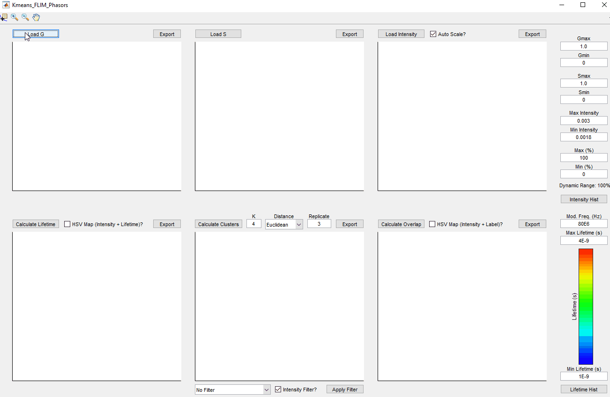
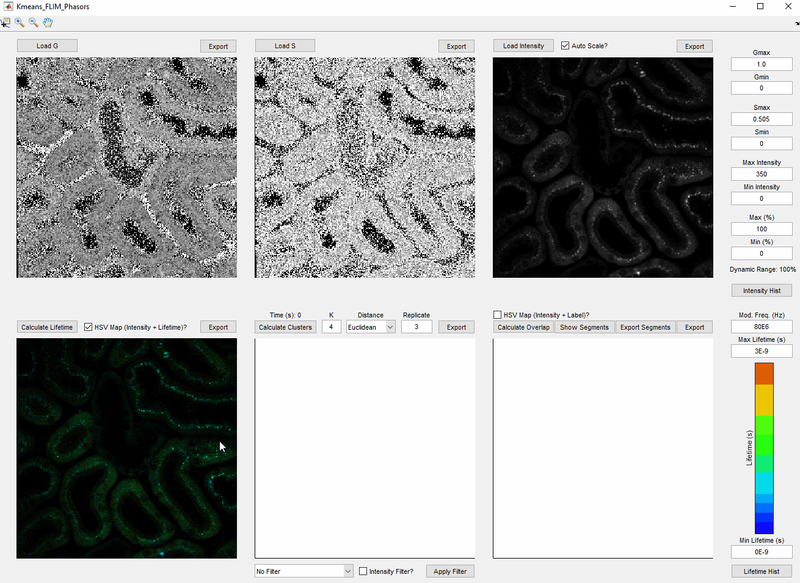
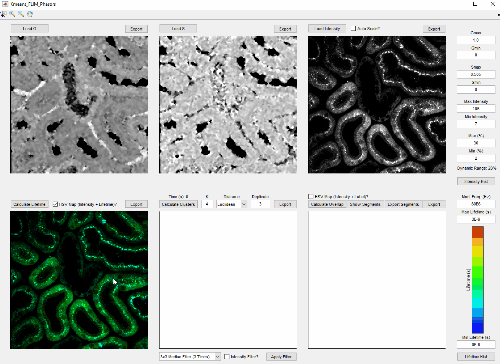
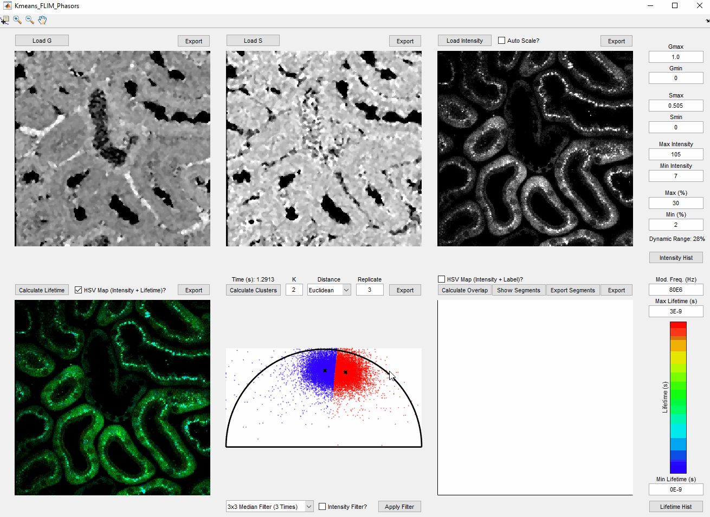

# Kmeans-FLIM-Phasors

This is the repository for the open-source program described in "Automatic segmentation of intravital fluorescence microscopy images by K-means clustering of FLIM phasors" by Yide Zhang et al.

## Installation
- Install Matlab
- Clone this repository:
```
git clone https://github.com/yzhang34/Kmeans-FLIM-Phasors.git
```
- Run the file 'Kmeans_FLIM_Phasors.m' with Matlab

## Example
- Load the phasor (G, S) and intensity files into the program. Supported formats include TIFF and CSV files.


- Specify the excitation modulation frequency (default=80 MHz) and calcuate fluorescence lifetimes. HSV mapping (with intensity image) can be selected to form a composite image. Lifetime ranges can be defined.


- Apply filters to phasor images (G and S) only (unclick 'Intensity Filter?'). Adjust the intensity display range. Lifetime image can be recalculated to refect the intensity change.


- Specify K-means clustering paramters: K, distance metric, and replicate times. Perform the clustering algorithm.


- Obtain the segmentation result by calculating the overlapping pixels corresponding to the clustered phasors. All the images in the program can be exported.



## Applications
- Save the phasor and intensity images to TIFF or CSV files with your exisiting FLIM system.
- Import the data into the program following the instructions in the example above.


## License & Copyright
© 2019 Yide Zhang, University of Notre Dame

Licensed under the [Apache License 2.0](LICENSE)
